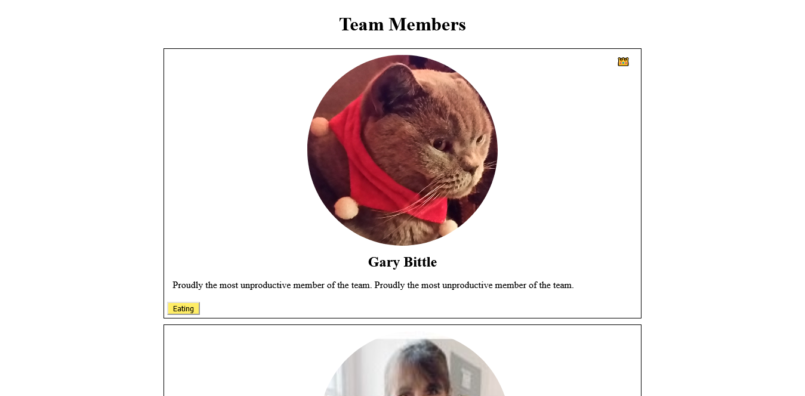

## Coding Interview Challenge

This is a simple web client which access an API to render the data to the web page.
The web page is build with HTML, CSS and Javascript alone.

API's used : http://sandbox.bittsdevelopment.com/code1/fetchemployees.php

Screenshots 

